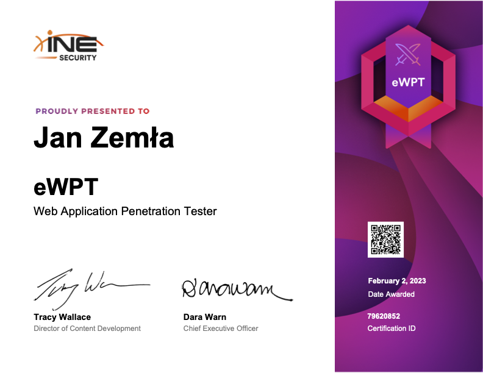
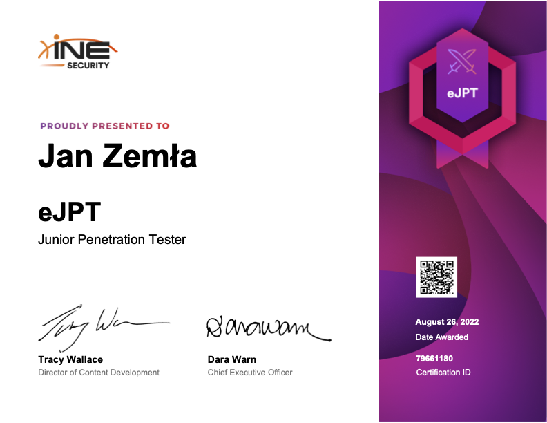
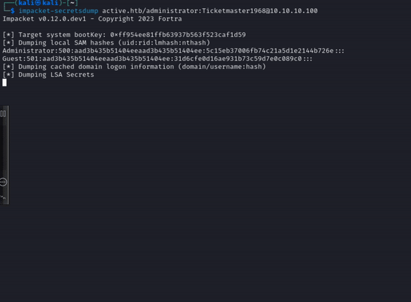

## 🕺🏼 Jan Zemla

**`Pentester & Security Researcher`**

I'm currently working for a company called EXATEL as Penetester, where I'm involved in testing of LANs (mainly Active Directory) and web applications. I started my cyber security journey already in high school, where I earned my first two Microsoft certifications, which then helped me get my first job as a Junior Penetration Tester.

#

### Certificates

**`Every certificate I earned:`**

<table>
  <thead>
    <tr>
      <th>Certification Name</th>
      <th>Issuer</th>
      <th>Date Issued</th>
    </tr>
  </thead>
  <tbody>
    <tr>
      <td>eLearnSecurity Web Penetration Tester</td>
      <td>eLearnSecurity</td>
      <td>2023-02</td>
    </tr>
    <tr>
      <td>eLearnSecurity Junior Penetration Tester</td>
      <td>eLearnSecurity</td>
      <td>2022-08</td>
    </tr>
    <tr>
      <td>Webapps hacking</td>
      <td>Niebezpiecznik.pl</td>
      <td>2021-08</td>
    </tr>
    <tr>
      <td>98-365:MTA: Windows Server Administration Fundamentals</td>
      <td>Microsoft</td>
      <td>2020-06</td>
    </tr>
     <tr>
      <td>MS-900 Microsoft 365 Fundamentals</td>
      <td>Microsoft</td>
      <td>2019-11</td>
    </tr>
  </tbody>
</table>

#

**My favorite AD pentest part:**

    

#

### Current Project

  <h3><a href="https://github.com/zemler/BurpExploits" style="text-decoration: none; color: #0366d6;">BurpExploits</a></h3>
  
Portswigger Academy labs exploits written in python

#

### Languages and Tools

