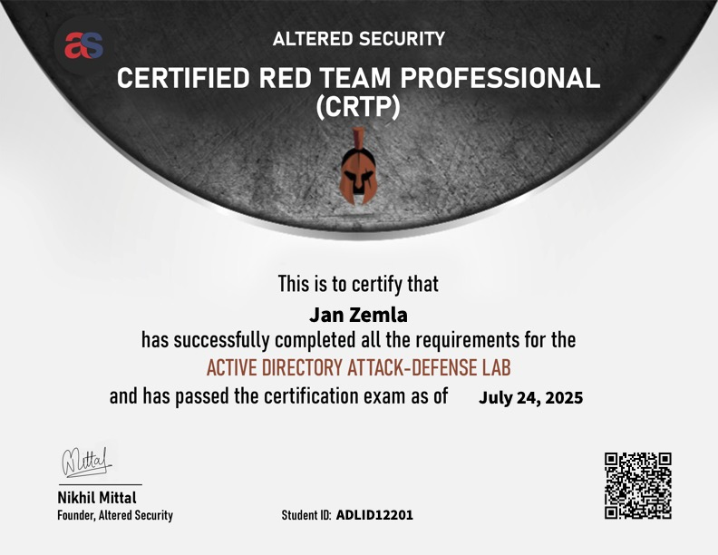

## 🕺🏼 Jan Zemla

**`Security Tester @ Purple Team`**

#

### Certificates

<table>
  <tr>
    <td></td>
    <td></td>
    <td></td>
  </tr>
  <tr>
    <td></td>
    <td></td>
    <td></td>
  </tr>
  <tr>
    <td></td>
    <td></td>
    <td></td>
  </tr>
</table>

**`Every certificate I earned:`**

<table>
  <thead>
    <tr>
      <th>Certification Name</th>
      <th>Issuer</th>
      <th>Date Issued</th>
    </tr>
  </thead>
  <tbody>
    <tr>
      <td>Certified Red Team Professional (CRTP)</td>
      <td>Altered Security</td>
      <td>2025-07</td>
    </tr>
    <tr>
      <td>Enterprise Defense Administrator</td>
      <td>INE Security</td>
      <td>2025-04</td>
    </tr>
    <tr>
      <td>Maldev Academy - Malware Development Course</td>
      <td>Maldev Academy</td>
      <td>2025-04</td>
    </tr>
    <tr>
      <td>eLearnSecurity Web Penetration Tester</td>
      <td>eLearnSecurity</td>
      <td>2023-02</td>
    </tr>
    <tr>
      <td>eLearnSecurity Junior Penetration Tester</td>
      <td>eLearnSecurity</td>
      <td>2022-08</td>
    </tr>
    <tr>
      <td>98-365:MTA: Windows Server Administration Fundamentals</td>
      <td>Microsoft</td>
      <td>2020-06</td>
    </tr>
     <tr>
      <td>MS-900 Microsoft 365 Fundamentals</td>
      <td>Microsoft</td>
      <td>2019-11</td>
    </tr>
  </tbody>
</table>

#

### Current Projects

<table>
  <thead>
    <tr>
      <th>Project Name</th>
      <th>Link</th>
    </tr>
  </thead>
  <tbody>
    <tr>
      <td>BurpExploits</td>
      <td><a href="https://github.com/zemler/BurpExploits">LINK</a></td>
    </tr>
    <tr>
      <td>RGuard</td>
      <td>TBA</td>
    </tr>
    <tr>
      <td>Telnet Honeypot</td>
      <td><a href="https://github.com/zemler/FalseTel">LINK</a></td>
    </tr>
    <tr>
      <td>Web Security Python library</td>
      <td><a href="https://github.com/zemler/webdrill">LINK</a></td>
    </tr>
  </tbody>
</table>

#

**My favorite AD pentest part:**

    

#

### Languages and Tools

